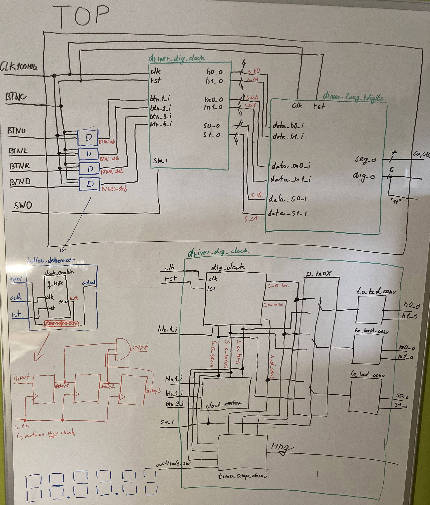

# Digital clock (hh mm ss) with time/alarm setting

### Team members

* František Bílek
* Viktor Buzovský
* Miroslav Babeľa
* Peter Balušík

### Table of contents

* [Project objectives](#objectives)
* [Hardware description](#hardware)
* [VHDL modules description and simulations](#modules)
* [TOP module description and simulations](#top)
* [Video](#video)
* [References](#references)

## Project objectives

Project goal is to implement digital clock on Nexys A7-50T board, including time setting and alarm function all in hh:mm:ss format.

The clock is controlled by 5 buttons and 2 switches. The output peripherals are an integrated eight digit 7-segment display (only 6 digits are used in this project) and an RGB LED implementing the alarm function.

## Hardware description

   #### Nexys A7-50T
   

| **Callout** | **Component Description** | **Callout** | **Component Description** |
   | :-: | :-: | :-: | :-: |
   | 1 | 	Power jack | 16 | JTAG port for (optional) external cable |
   | 2 | 	Power switch | 17 | Tri-color (RGB) LEDs |
   | 3 | USB host connector | 18 | Slide switches (16) |
   | 4 | PIC24 programming port (factory use) | 19 | LEDs (16) |
   | 5 | Ethernet connector | 20 | Power supply test point(s) |
   | 6 | FPGA programming done LED | 21 | Eight digit 7-seg display |
   | 7 | VGA connector | 22 | Microphone |
   | 8 | Audio connector | 23 | External configuration jumper (SD / USB) |
   | 9 | Programming mode jumper | 24 | MicroSD card slot |
   | 10 | Analog signal Pmod port (XADC) | 25 | Shared UART/ JTAG USB port |
   | 11 | FPGA configuration reset button | 26 | Power select jumper and battery header |
   | 12 | CPU reset button (for soft cores) | 27 | Power-good LED |
   | 13 | Five pushbuttons | 28 | Xilinx Artix-7 FPGA |
   | 14 | Pmod port(s) | 29 | DDR2 memory |
   | 15 | Temperature sensor |  |  |
   
   #### BASIC I/O schematic
   
   

## VHDL modules description

### `dig_clock.vhd`
This module ensures the functionality of the digital clock as such. It takes clock signal which is slow down to 1 second using the `clock_enable.vhd` module by setting the `g_MAX` value to 10 000 000. The second value increases by one every second, but to 59 and then back to zero. In the same way, the minute value also increases after the second value reaches 59, but up to 59. The hourly value increases when the minute value reaches 59 and rises to 23 and resets again to zero.

By default, the time runs from 00:00:00. If we press the bottom button, the module reads the hours and minutes values from the `clock_setter.vhd` module and further counts the time from them.

[dig_clock testbench](project_3/project_3.srcs/sim_1/new/tb_digital_clock.vhd)

### `time_comp_alarm.vhd`
This module works both to remember the set alarm time from `clock_setter.vhd` module and to trigger the alarm at the correct time. By activating `button_set` we assign alarm-time values to internal signals `memory_mins` and `memory_hrs`. The alarm function is active only when `activate_sw_i` is in the 1 position. If the values of the set alarm time and the current time are equal, the alarm is triggered.

[time_comp_alarm testbench]()

### `button_debouncer.vhd`
Mechanical pushbutton often generate fake transitions when pressed due to its mechanical nature. If we want to set the time using pushbuttons, these fake transitions would be very problematic and it is necessary to get rid of them. Module called `button_debouncer` is used to do the job. It consists of three D-latches connected in series. The first one takes the push button signal as its input. When the enable signal is on high level, the input gest shifted to the next latch. The outputs of all three latches are connected to an AND gate which output is output of the whole debouncer. `clock_enable.vhd` module is used as synchronous signal generator where its `g_MAX` value is set to 1 000 000 for 100 ms debounce delay.

[button_debouncer testbench]()

### `clock_setter.vhd`
Using this module, we set the time and choose whether it is the time from which the clock should continue to run or the time in which the alarm should be triggered. Apart from standard clock signal and enable signal, there are 2 buttons as inputs, using which we set the hours and minutes, and one switch, which we activate the module with. The outputs of this block are the values of the hours and minutes we set.

[clock_setter testbench]()

### `cnt_up_down.vhd`
Predesigned bidirectional counter from lab exercises used without any changes.

[cnt_up_down testbench]()

### `hex_7seg.vhd`
Predesigned 7-segment display decoder from lab exercises used without any changes.

[hex_7seg testbench]()

### `driver_7seg_6digits.vhd`
Predesigned display driver from lab exercises modified to control 6 digits (hh:mm:ss).

[driver_7seg_6digits testbench]()

### `to_bcd_conv.vhd`
The outputs of the `dig_clock.vhd` module are 6-bit vectors in case of minutes and seconds and a 5-bit vector in case of hours. This block is used to convert these vectors into two 4-bit BCD values, each representing one decimal digit, which then can be feed into the 7-segment driver.

[to_bcd_conv testbench]()

### `clock_enable.vhd`
Predesigned clock enable signal generator from lab exercises.

[clock_enable testbench]()

### `driver_dig_clock.vhd`
This block is used to encapsulate the `dig_clock.vhd`, `clock_setter.vhd` and `time_comp_alarm.vhd` modules. In addition, it contains a multiplexer, which switches between the current time display and the time setting, depending on the selected mode.

[driver_dig_clock testbench]()

## TOP module description and simulations

All mentioned blocks are connected in the `top.vhd` module and connected to hardware components.

[top module testbench]()

## Video

Write your text here

## References

1. Write your text here.
